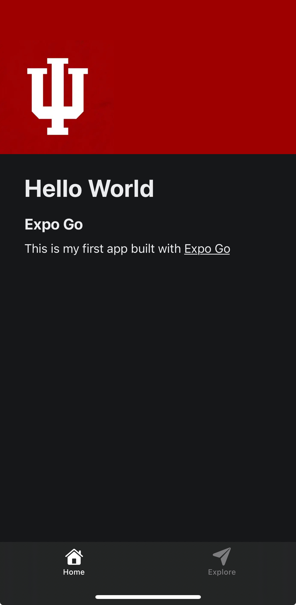

## Homework 1

### Assignment Instructions

1. Install Node.js
    - Node.js: https://nodejs.org

2. Create a new project

```
# Create new Expo project 
npx create-expo-app hello-world
 
# Move into project folder 
cd hello-world 

# Start Expo development server 
npx expo start
```

3. Open the app in Expo GoLinks to an external site. on your phone.

4. Replace the default text with your own custom message.

5. Change the background color of the main view.

### Set Up Instructions

1. Clone repository

```
git clone https://github.com/csalguera/newm-n322
cd newm-n322/hello-world
```

2. Install dependencies

```
npm install
```

3. Start the development server

```
npx expo start
```

### Expo Go Screenshot

