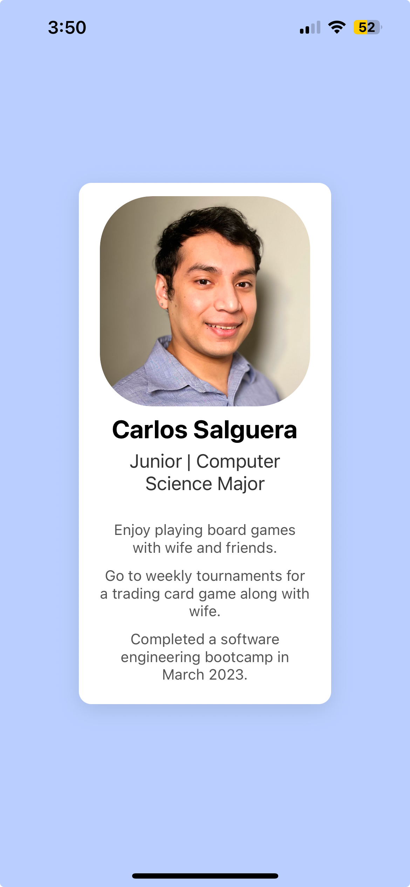

## Homework Assignment 2

### About

This app is a simple project that displays some information about myself. Such as hobbies, academic status, and major.

The various information is displayed within a card and styled with flexbox for a clean layout.

### How to Install

1. Clone repository

```
git clone https://github.com/csalguera/newm-n322
cd newm-n322/profile-card
```

2. Install dependencies

```
npm install
```

3. Start the development server

```
npx expo start
```

### App preview

