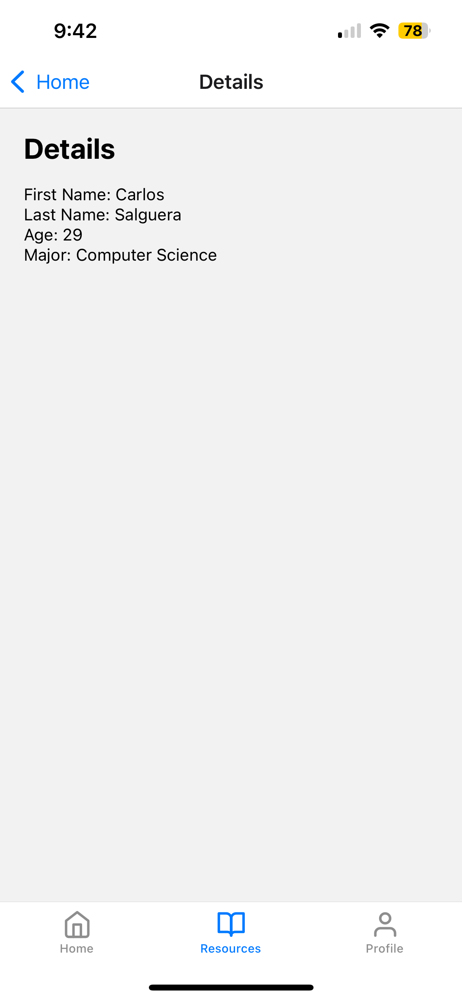

### Homework 4 - Student Hub

#### About

This project was built with React Native, Expo Go, and React Hooks to manage navigation. This app is a simple routing application that focuses on bottom-tab and stack navigation. In addition, prop drilling and destructuring are used to to provide and access properties (props) across different components, or in this case, screens.

#### How to Run Locally

1. Clone Repository

```
git clone https://github.com/csalguera/newm-n322
cd newm-n322/student-hub
```

2. Install Dependencies

```
npm install
```

3. Start the Server

```
npx expo start --tunnel
```

#### App Preview

