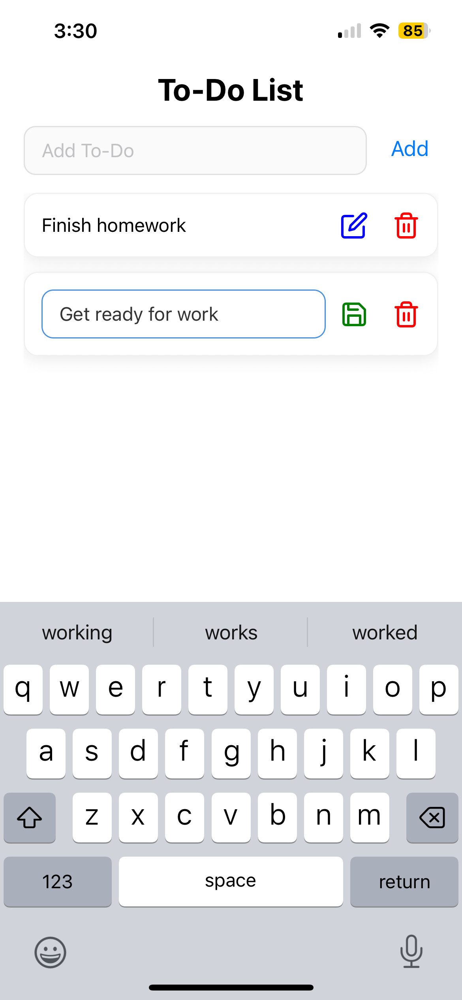

### Homework 3 - To-Do List

#### About

This project was built with React Native, Expo Go, and React Hooks to manage state. This app is a simple CRUD (create, read, update, and delete) application that allows users to create a list of to-do items.

#### How to Run Locally

1. Clone Repository

```
git clone https://github.com/csalguera/newm-n322
cd newm-n322/todo-list
```

2. Install Dependencies

```
npm install
```

3. Start the Server

```
npx expo start --tunnel
```

#### App Preview

